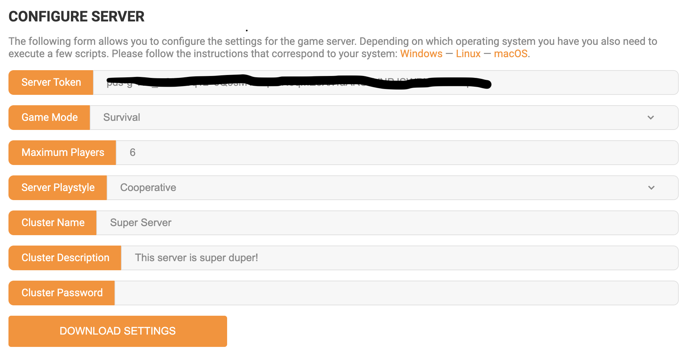

### Teach you how to initialize a don't starve dedicated server on Linux Environment step by step

Most of the steps come from [the Klei official forum](https://forums.kleientertainment.com/forums/topic/64441-dedicated-server-quick-setup-guide-linux/). I try to make these steps simple.

1. Declare a server. I use AWS EC2 t3.medium machine and the system is Ubuntu Server 18.04 LTS. Don't use the t2.micro machine free-tier, which is too inefficient to run the dedicated server. **Make sure you open the following UDP ports in the shell command, which are 27019, 48313, 11001, 60876, 27018, 39042, 11000 and 10889.** **If you feel it's difficult, you can open all TCP and UDP ports.** However, the attacker might be able to utilize these free ports.

   ```shell
   ubuntu@ip-172-31-3-86:~$ lsof -i
   COMMAND    PID   USER   FD   TYPE DEVICE SIZE/OFF NODE NAME
   dontstarv 1837 ubuntu   21u  IPv4  25048      0t0  TCP ip-172-31-3-86.ec2.internal:47698->ec2-52-73-128-206.compute-1.amazonaws.com:https (ESTABLISHED)
   dontstarv 1837 ubuntu   22u  IPv4  25037      0t0  UDP *:27019
   dontstarv 1837 ubuntu   25u  IPv4  25039      0t0  TCP ip-172-31-3-86.ec2.internal:41293->162.254.193.74:27038 (ESTABLISHED)
   dontstarv 1837 ubuntu   26u  IPv4  24161      0t0  UDP *:48313
   dontstarv 1837 ubuntu   28u  IPv4  25070      0t0  TCP ip-172-31-3-86.ec2.internal:55770->server-18-67-79-24.iad89.r.cloudfront.net:https (ESTABLISHED)
   dontstarv 1837 ubuntu   29u  IPv4  24170      0t0  TCP ip-172-31-3-86.ec2.internal:59648->ac06bdf57acc78add.awsglobalaccelerator.com:https (CLOSE_WAIT)
   dontstarv 1837 ubuntu   30u  IPv4  24175      0t0  UDP *:11001
   dontstarv 1837 ubuntu   31u  IPv4  24200      0t0  UDP *:60876
   dontstarv 1837 ubuntu   32u  IPv4  24239      0t0  TCP ip-172-31-3-86.ec2.internal:40532->ec2-18-211-164-55.compute-1.amazonaws.com:https (ESTABLISHED)
   dontstarv 1839 ubuntu   21u  IPv4  25047      0t0  TCP ip-172-31-3-86.ec2.internal:47696->ec2-52-73-128-206.compute-1.amazonaws.com:https (ESTABLISHED)
   dontstarv 1839 ubuntu   22u  IPv4  25036      0t0  UDP *:27018
   dontstarv 1839 ubuntu   23u  IPv4  25040      0t0  UDP *:39042
   dontstarv 1839 ubuntu   24u  IPv4  24160      0t0  TCP ip-172-31-3-86.ec2.internal:33743->162.254.193.74:27038 (ESTABLISHED)
   dontstarv 1839 ubuntu   28u  IPv4  24197      0t0  TCP ip-172-31-3-86.ec2.internal:55964->server-18-67-79-211.iad89.r.cloudfront.net:https (ESTABLISHED)
   dontstarv 1839 ubuntu   30u  IPv4  24173      0t0  UDP *:11000
   dontstarv 1839 ubuntu   31u  IPv4  25072      0t0  UDP localhost:10889
   dontstarv 1839 ubuntu   32u  IPv4  24238      0t0  TCP ip-172-31-3-86.ec2.internal:58896->ec2-52-55-176-112.compute-1.amazonaws.com:https (ESTABLISHED)
   ```

2. Declare a new game cluster in [the Klei official sites](https://accounts.klei.com/account/game/servers?game=DontStarveTogether), which contains your unique server token and config files. Download the config settings to your computer. After unzipping the folder, you can edit the config files based on your needs. Here are my example config files.

   

   1. cluster.ini for the whole cluster.

      ```ini
      
      [GAMEPLAY]
      game_mode = survival
      max_players = 6
      pvp = false
      pause_when_empty = true
      
      [NETWORK]
      cluster_description = This server is super duper!
      cluster_name = example
      cluster_intention = cooperative
      cluster_password = 111111
      cluster_language = zh
      
      [MISC]
      console_enabled = true
      
      [SHARD]
      shard_enabled = true
      bind_ip = 127.0.0.1
      master_ip = 127.0.0.1
      master_port = 10889
      cluster_key = supersecretkey
      
      ```

   2. server.ini for the cave world.

      ```ini
      
      [NETWORK]
      server_port = 11001
      
      [SHARD]
      is_master = false
      name = Caves
      
      [STEAM]
      master_server_port = 27019
      authentication_port = 8769
      
      ```

   3. server.ini for the master world.

      ```ini
      
      [NETWORK]
      server_port = 11000
      
      [SHARD]
      is_master = true
      
      [STEAM]
      master_server_port = 27018
      authentication_port = 8768
      
      ```

3. Login to your Linux server and download the dependencies.

   ```shell
   sudo dpkg --add-architecture i386
   sudo apt-get update
   sudo apt-get install libstdc++6:i386 libgcc1:i386 libcurl4-gnutls-dev:i386 -y
   ```

4. Download the steamcmd in your user root path.

   ```shell
   mkdir -p ~/steamcmd/
   cd ~/steamcmd/
   wget "https://steamcdn-a.akamaihd.net/client/installer/steamcmd_linux.tar.gz"
   tar -xvzf steamcmd_linux.tar.gz
   mkdir -p ~/.klei/DoNotStarveTogether/
   cd ~
   ```

5. Upload the config folder whose name is MyDediServer by default, from your computer to your server. I use the scp command.

   ```
   scp -i ~/.ssh/example.pem -r Downloads/MyDediServer  ubuntu@server_public_ip:~/.klei/DoNotStarveTogether/
   ```

6. Create this shell script and move it to ~/run_dedicated_servers.sh.

   ```shell
   #!/bin/bash
   
   steamcmd_dir="$HOME/steamcmd"
   install_dir="$HOME/dontstarvetogether_dedicated_server"
   cluster_name="MyDediServer"
   dontstarve_dir="$HOME/.klei/DoNotStarveTogether"
   
   function fail()
   {
   	echo Error: "$@" >&2
   	exit 1
   }
   
   function check_for_file()
   {
   	if [ ! -e "$1" ]; then
   		fail "Missing file: $1"
   	fi
   }
   
   cd "$steamcmd_dir" || fail "Missing $steamcmd_dir directory!"
   
   check_for_file "steamcmd.sh"
   check_for_file "$dontstarve_dir/$cluster_name/cluster.ini"
   check_for_file "$dontstarve_dir/$cluster_name/cluster_token.txt"
   check_for_file "$dontstarve_dir/$cluster_name/Master/server.ini"
   check_for_file "$dontstarve_dir/$cluster_name/Caves/server.ini"
   
   ./steamcmd.sh +force_install_dir "$install_dir" +login anonymous +app_update 343050 +quit
   
   check_for_file "$install_dir/bin64"
   
   cd "$install_dir/bin64" || fail
   
   run_shared=(./dontstarve_dedicated_server_nullrenderer_x64)
   run_shared+=(-console)
   run_shared+=(-cluster "$cluster_name")
   run_shared+=(-monitor_parent_process $$)
   
   "${run_shared[@]}" -shard Caves  | sed 's/^/Caves:  /' &
   "${run_shared[@]}" -shard Master | sed 's/^/Master: /'
   ```

7. Give the starting shell execution authority and run this script.

   ```shell
   chmod +x ~/run_dedicated_servers.sh
   cd ~
   # you can run this script in the tmux
   ./run_dedicated_servers.sh
   ```


### Optional: Add the mods for your dedicated server

You can initialize a world and then copy the configuration files to the server.

1. Open the mods config file in your server.

   ```shell
   vim ~/dontstarvetogether_dedicated_server/mods/dedicated_server_mods_setup.lua
   ```

2. Add the mods based on your needs like the following script.

   ```lua
   --There are two functions that will install mods, ServerModSetup and ServerModCollectionSetup. Put the calls to the functions in this file and they will be executed on boot.
   
   --ServerModSetup takes a string of a specific mod's Workshop id. It will download and install the mod to your mod directory on boot.
           --The Workshop id can be found at the end of the url to the mod's Workshop page.
           --Example: http://steamcommunity.com/sharedfiles/filedetails/?id=350811795
           --ServerModSetup("350811795")
   
   --ServerModCollectionSetup takes a string of a specific mod's Workshop id. It will download all the mods in the collection and install them to the mod directory on boot.
           --The Workshop id can be found at the end of the url to the collection's Workshop page.
           --Example: http://steamcommunity.com/sharedfiles/filedetails/?id=379114180
           --ServerModCollectionSetup("379114180")
   ServerModSetup("1378549454")
   ServerModSetup("347079953")
   ```

3. Make these mods available for your world by creating modoverrides.lua in your world project.

   ```shell
   cd .klei/DoNotStarveTogether/MyDediServer/
   touch Caves/modoverrides.lua
   touch Master/modoverrides.lua
   ```

4. Add these content to modoverrides.lua. Some of modes have configurations which can be added in the configuration_options.

   ```lua
   return {
       ["workshop-1378549454"]={
         configuration_options={  }, 
         enabled=true
       },
       ["workshop-347079953"]={
         configuration_options={  }, 
         enabled=true
       }
     }  
   ```


### Optional: Customize your own world

You can initialize a world and then copy the configuration files to the server. The configuration options can be found on [this forum](https://dontstarve.fandom.com/wiki/Guides/Don%E2%80%99t_Starve_Together_Dedicated_Servers#Customizing_the_World_Map).

1. Create leveldataoverride.lua in your world project.

   ```shell
   cd .klei/DoNotStarveTogether/MyDediServer/
   touch Caves/leveldataoverride.lua
   touch Master/leveldataoverride.lua
   ```

2. Add the configurations based on your needs like the following script. This map configuration is designed for the ground world. The cave configuration is similar but it's different.

   ```lua
   return {
       desc="标准《饥荒》体验。",
       hideminimap=false,
       id="SURVIVAL_TOGETHER",
       location="forest",
       max_playlist_position=999,
       min_playlist_position=0,
       name="标准森林",
       numrandom_set_pieces=4,
       override_level_string=false,
       overrides={
         alternatehunt="default",
         angrybees="default",
         antliontribute="default",
         autumn="longseason",
         bats_setting="default",
         bearger="never",
         beefalo="default",
         beefaloheat="default",
         beequeen="default",
         bees="default",
         bees_setting="default",
         berrybush="default",
         birds="default",
         boons="default",
         branching="default",
         brightmarecreatures="default",
         bunnymen_setting="default",
         butterfly="default",
         buzzard="default",
         cactus="default",
         carrot="default",
         carrots_regrowth="default",
         catcoon="default",
         catcoons="default",
         chess="default",
         cookiecutters="default",
         crabking="default",
         day="default",
         deciduousmonster="never",
         deciduoustree_regrowth="default",
         deerclops="never",
         dragonfly="never",
         dropeverythingondespawn="default",
         evergreen_regrowth="default",
         extrastartingitems="default",
         eyeofterror="never",
         fishschools="default",
         flint="default",
         flowers="default",
         flowers_regrowth="default",
         frograin="default",
         frogs="default",
         fruitfly="default",
         gnarwail="default",
         goosemoose="never",
         grass="default",
         grassgekkos="default",
         has_ocean=true,
         hound_mounds="default",
         houndmound="default",
         hounds="default",
         hunt="default",
         keep_disconnected_tiles=true,
         klaus="default",
         krampus="default",
         layout_mode="LinkNodesByKeys",
         liefs="default",
         lightning="default",
         lightninggoat="default",
         loop="default",
         lureplants="default",
         malbatross="default",
         marshbush="default",
         merm="default",
         merms="default",
         meteorshowers="default",
         meteorspawner="default",
         moles="default",
         moles_setting="default",
         moon_berrybush="default",
         moon_bullkelp="default",
         moon_carrot="default",
         moon_fissure="default",
         moon_fruitdragon="default",
         moon_hotspring="default",
         moon_rock="default",
         moon_sapling="default",
         moon_spider="default",
         moon_spiders="default",
         moon_starfish="default",
         moon_tree="default",
         moon_tree_regrowth="default",
         mosquitos="default",
         mushroom="default",
         mutated_hounds="default",
         no_joining_islands=true,
         no_wormholes_to_disconnected_tiles=true,
         ocean_bullkelp="default",
         ocean_seastack="ocean_default",
         ocean_shoal="default",
         ocean_waterplant="ocean_default",
         ocean_wobsterden="default",
         penguins="default",
         penguins_moon="default",
         perd="default",
         petrification="default",
         pigs="default",
         pigs_setting="default",
         ponds="default",
         prefabswaps_start="default",
         rabbits="default",
         rabbits_setting="default",
         reeds="default",
         regrowth="default",
         roads="default",
         rock="default",
         rock_ice="default",
         saltstack_regrowth="default",
         sapling="default",
         season_start="default",
         seasonalstartingitems="default",
         shadowcreatures="default",
         sharks="default",
         spawnprotection="default",
         specialevent="default",
         spider_warriors="default",
         spiderqueen="default",
         spiders="default",
         spiders_setting="default",
         spring="default",
         squid="default",
         start_location="default",
         summer="default",
         tallbirds="default",
         task_set="default",
         tentacles="default",
         terrariumchest="default",
         touchstone="default",
         trees="default",
         tumbleweed="default",
         twiggytrees_regrowth="default",
         walrus="default",
         walrus_setting="default",
         wasps="default",
         weather="default",
         wildfires="default",
         winter="shortseason",
         wobsters="default",
         world_size="default",
         worldseed="",
         wormhole_prefab="wormhole"
       },
       random_set_pieces={
         "Sculptures_2",
         "Sculptures_3",
         "Sculptures_4",
         "Sculptures_5",
         "Chessy_1",
         "Chessy_2",
         "Chessy_3",
         "Chessy_4",
         "Chessy_5",
         "Chessy_6",
         "Maxwell1",
         "Maxwell2",
         "Maxwell3",
         "Maxwell4",
         "Maxwell6",
         "Maxwell7",
         "Warzone_1",
         "Warzone_2",
         "Warzone_3"
       },
       required_prefabs={ "multiplayer_portal" },
       required_setpieces={ "Sculptures_1", "Maxwell5" },
       settings_desc="标准《饥荒》体验。",
       settings_id="SURVIVAL_TOGETHER",
       settings_name="标准森林",
       substitutes={  },
       version=4,
       worldgen_desc="标准《饥荒》体验。",
       worldgen_id="SURVIVAL_TOGETHER",
       worldgen_name="标准森林"
     }  
   ```

   

